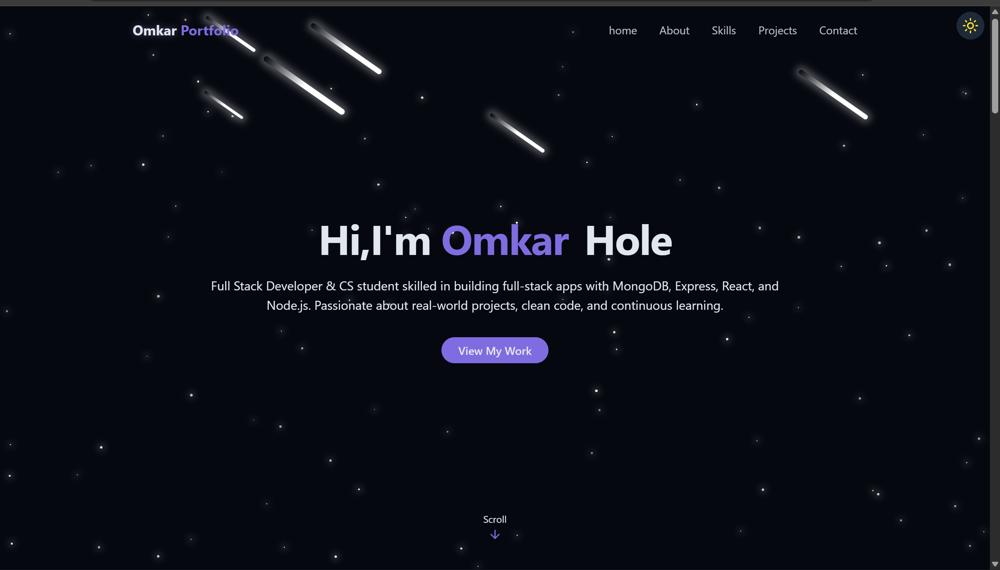
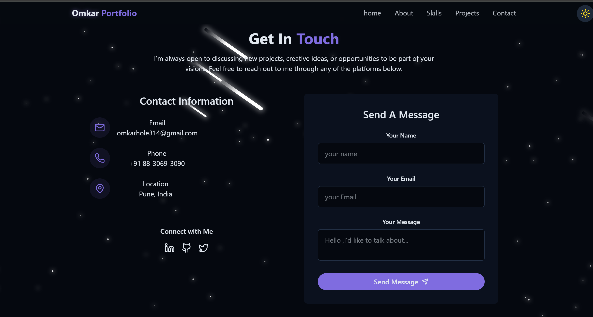
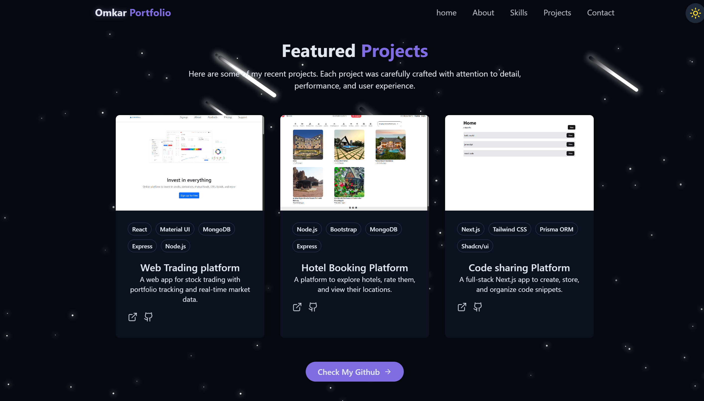

<div align="center">

# Portfolio

[](https://reactjs.org/)
[](https://vitejs.dev/)
[](https://tailwindcss.com/)
[](LICENSE)

A modern, performant portfolio website featuring smooth animations, theme switching, and responsive design.

[Live Demo](https://portfolio-gamma-smoky-11.vercel.app/) · [Report Bug](https://github.com/omkarhole/portfolio/issues) · [Request Feature](https://github.com/omkarhole/portfolio/issues)

</div>

---

## 📸 Preview

<div align="center">
  
  <br/><br/>
  
  <br/><br/>
  
</div>

---

## 📋 Table of Contents

- [Features](#-features)
- [Tech Stack](#-tech-stack)
- [Getting Started](#-getting-started)
- [Project Structure](#-project-structure)
- [Configuration](#-configuration)
- [Deployment](#-deployment)
- [Contributing](#-contributing)
- [License](#-license)
- [Contact](#-contact)

---

## ✨ Features

| Feature | Description |
|---------|-------------|
| **Modern UI/UX** | Clean, professional interface with smooth animations and transitions |
| **Dark/Light Theme** | Seamless theme switching with persistent user preference |
| **Animated Background** | Dynamic star field animation for visual appeal |
| **Responsive Design** | Optimized for all screen sizes and devices |
| **Fast Performance** | Built with Vite for sub-second page loads |
| **Contact Integration** | Functional contact form powered by EmailJS |
| **SPA Navigation** | Smooth client-side routing with React Router |

---

## 🛠 Tech Stack

<div align="center">

| Category | Technologies |
|----------|-------------|
| **Framework** | React 19 |
| **Build Tool** | Vite 5 |
| **Styling** | Tailwind CSS |
| **Icons** | Lucide React |
| **Routing** | React Router DOM |
| **Forms** | EmailJS |
| **Notifications** | React Toastify |

</div>

---

## 🚀 Getting Started

### Prerequisites

- **Node.js** v18.0 or higher
- **npm** v9.0+ or **yarn** v1.22+

### Installation

```bash
# Clone the repository
git clone https://github.com/omkarhole/portfolio.git

# Navigate to project directory
cd portfolio

# Install dependencies
npm install

# Start development server
npm run dev
```

The application will be available at `http://localhost:5173`

### Available Scripts

| Command | Description |
|---------|-------------|
| `npm run dev` | Start development server |
| `npm run build` | Build for production |
| `npm run preview` | Preview production build |
| `npm run lint` | Run ESLint |

---

## 📁 Project Structure

```
portfolio/
├── public/
│   └── projects/          # Project screenshots
├── src/
│   ├── Components/
│   │   ├── ContactSection/
│   │   │   ├── Section1.jsx
│   │   │   └── Section2.jsx
│   │   ├── ui/
│   │   │   └── BlurText.jsx
│   │   ├── AboutSection.jsx
│   │   ├── ContactSection.jsx
│   │   ├── Footer.jsx
│   │   ├── HeroSection.jsx
│   │   ├── NavBar.jsx
│   │   ├── ProjectsSection.jsx
│   │   ├── SkillSection.jsx
│   │   ├── SmoothCursor.jsx
│   │   ├── StarBackground.jsx
│   │   └── ThemeToggle.jsx
│   ├── assets/            # Static assets & icons
│   ├── lib/
│   │   └── utils.jsx      # Utility functions
│   ├── pages/
│   │   ├── Home.jsx
│   │   └── NotFound.jsx
│   ├── App.jsx
│   ├── main.jsx
│   └── index.css
├── eslint.config.js
├── tailwind.config.js
├── vite.config.js
└── package.json
```

---

## ⚙ Configuration

### Theme Customization

Modify `tailwind.config.js` to customize the color palette:

```javascript
export default {
  theme: {
    extend: {
      colors: {
        primary: '#your-color',
        secondary: '#your-color',
      }
    }
  }
}
```

### EmailJS Setup

1. Create an account at [emailjs.com](https://www.emailjs.com/)
2. Configure your email service and template
3. Update credentials in the contact component:

```javascript
// src/Components/ContactSection.jsx
const SERVICE_ID = 'your_service_id';
const TEMPLATE_ID = 'your_template_id';
const PUBLIC_KEY = 'your_public_key';
```

---

## 📦 Deployment

### Build for Production

```bash
npm run build
```

The optimized build will be generated in the `dist/` directory.

### Deployment Platforms

| Platform | Method |
|----------|--------|
| **Vercel** | Connect GitHub repository for automatic CI/CD |
| **Netlify** | Drag & drop `dist/` folder or connect repository |
| **GitHub Pages** | Configure GitHub Actions workflow |

---

## 🤝 Contributing

Contributions are welcome! Please follow these steps:

1. Fork the repository
2. Create a feature branch: `git checkout -b feature/YourFeature`
3. Commit changes: `git commit -m 'Add YourFeature'`
4. Push to branch: `git push origin feature/YourFeature`
5. Open a Pull Request

Please ensure your code follows the existing style and includes appropriate documentation.

---

## 📄 License

This project is licensed under the MIT License. See the [LICENSE](LICENSE) file for details.

---

## 📬 Contact

<div align="center">

**Omkar Hole**

[](https://www.linkedin.com/in/omkar-hole-c0der/)
[](https://github.com/omkarhole)
[](mailto:omkarhole314@gmail.com)

</div>

---

<div align="center">

**If you found this project helpful, please consider giving it a ⭐**

</div>
